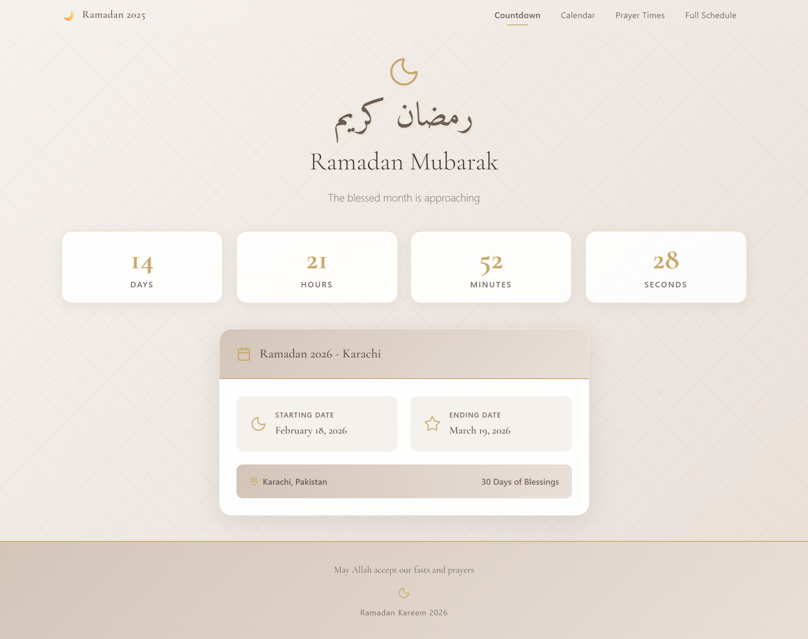

<h1 align="center">🌙 Ramadan Calendar & Prayer Times Counter</h1>

  A fully dynamic Ramadan calendar web app with real-time prayer times API integration and live countdown.

  
  
  
  

---
## 📌 Project Overview

This is a real-world web application built with React that shows:
• Live prayer times from an API  
• A Ramadan calendar  
• A real-time countdown timer  
The website updates automatically using live data and works smoothly on all devices.

---
## ⚙️ Tech Stack

  
  
  
  
  
  
  
  

---
## 🔗 Live Preview

  
  

---

## 🚀 Features

- Real-time prayer times fetched from API  
- Live Ramadan countdown timer  
- Fully dynamic content  
- Responsive across all devices  
- Fast optimized build  
- Clean UI structure  

---
## 👩‍💻 Author

**Imama Ansari**  
Frontend Web Developer  

GitHub: https://github.com/imama-ansari14  
LinkedIn: https://www.linkedin.com/in/imama-ansari-5a604b337  

---

## ⭐ If you find this project useful, consider giving it a star!
